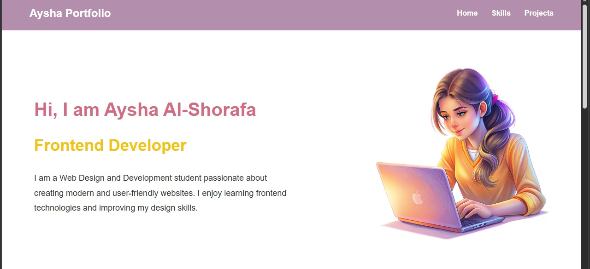
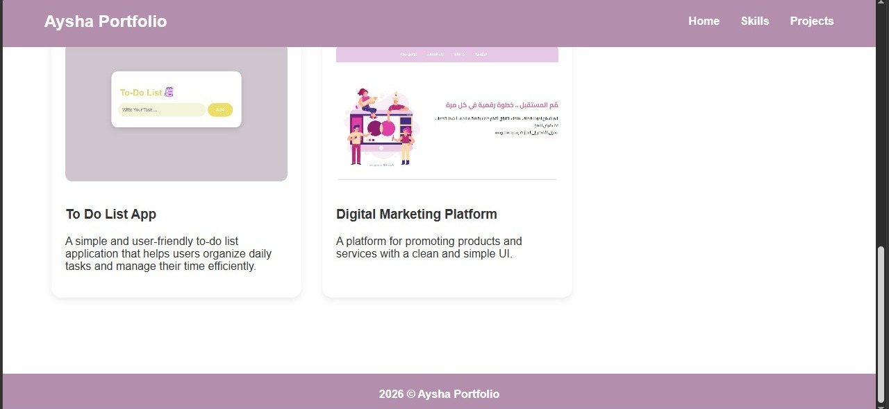

# Modern Portfolio

A modern personal portfolio website built using HTML and CSS.

---

## Features

- Responsive design
- Modern UI
- Skills section
- Projects section
- Clean layout

---

## Technologies Used

- HTML
- CSS
- Git
- GitHub

---

## Screenshots

### Home Section

### Skills and Projects

### Footer

---

## How to Run

1. Download or clone the repository
2. Open `index.html` in your browser

---

## Author

Aysha Al-Shorafa
